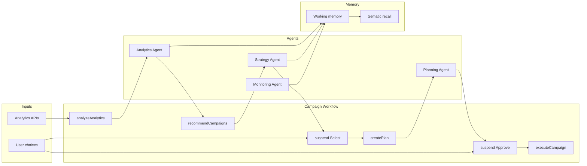

# Mastra for Your Marketing Agentic AI Project

## 1. Current Workspace Summary

Your project already has:

- **Mastra app** in `[marketing-agent/src/mastra/](marketing-agent/src/mastra/)`: `index.ts` (Mastra instance with LibSQL storage, Pino logger, Observability with DefaultExporter + CloudExporter), a **weather** agent/workflow/tool/scorers as a reference.
- **Standalone MCP server** in `[marketing-agent/server.js](marketing-agent/server.js)`: tools `get_campaign_analytics`, `compare_kpi`, `recommend_campaign`, `create_campaign` (simulated KPIs; no real GA/Search Console/Facebook/Instagram yet).
- **Stack**: Node ESM, `@mastra/core`, `@mastra/evals`, `@mastra/libsql`, `@mastra/memory`, `@mastra/observability`; Mastra Studio via `npm run dev` (localhost:4111).

You will **extend** the Mastra app (new agents, workflow, tools, memory) and eventually **wire** real analytics APIs and/or the MCP tools into Mastra (e.g. via MCP client or reimplemented as Mastra tools).

---

## 2. Mastra Setup Step-by-Step (Before Coding)

You already did the base setup. For the **marketing** system, add these steps:


| Step | Action                      | Your use case                                                                                                                                                                                                                       |
| ---- | --------------------------- | ----------------------------------------------------------------------------------------------------------------------------------------------------------------------------------------------------------------------------------- |
| 1    | **Dependencies**            | You have `@mastra/core`, `@mastra/memory`, `@mastra/evals`, `@mastra/observability`, `@mastra/libsql`. Add `@mastra/mcp` only if you want Mastra to load the marketing MCP server as tools.                                         |
| 2    | **Environment**             | `.env`: `OPENAI_API_KEY` (or other provider). Later: `GOOGLE_ANALYTICS_`*, `FACEBOOK_`*, etc. for real APIs.                                                                                                                        |
| 3    | **Storage**                 | Keep LibSQL (`file:./mastra.db`) for dev. Needed for: workflow snapshots (suspend/resume), observability traces, memory (message history + optional vector store for semantic recall).                                              |
| 4    | **Vector store** (optional) | For **semantic memory** (e.g. “past analytics insights”, “similar campaigns”): add a vector DB. LibSQL can double as vector store (`LibSQLVector` same URL). Configure in Memory.                                                   |
| 5    | **Mastra instance**         | In `src/mastra/index.ts`: register the new **agents**, **workflow**, **scorers**; keep existing storage, logger, observability.                                                                                                     |
| 6    | **Entry point**             | Same as now: `npm run dev` for Studio; `npm run build` for production. No UI required; you can run the workflow from a script or API that calls `mastra.getWorkflow('campaignWorkflow').createRun().start(...)` and `.resume(...)`. |


No need to create a new Mastra project; you are **adding** to the existing one.

---

## 3. How to Define Agents for Your Use Case

Mastra **agents** use LLMs + tools to do open-ended tasks. For your pipeline, define **focused agents** and use the **workflow** to orchestrate them (so the flow is predictable and human approvals are at fixed steps).


| Agent                  | Role                                                 | Input (conceptual)                                 | Output                                                        | Tools                                                                                |
| ---------------------- | ---------------------------------------------------- | -------------------------------------------------- | ------------------------------------------------------------- | ------------------------------------------------------------------------------------ |
| **Analytics Agent**    | Analyze GA, Search Console, Facebook, Instagram data | Raw or summarized analytics + date range           | Structured insights (trends, top channels, issues)            | Tools that fetch GA, GSC, FB/IG (or MCP tools that wrap APIs)                        |
| **Strategy Agent**     | Recommend 3 campaigns (2×7d, 1×14d)                  | Analytics insights                                 | 3 campaign ideas with duration, rationale, goals              | `recommend_campaign`-style tool (or strategy tool that calls it)                     |
| **Planning Agent**     | Turn selected campaign into a detailed plan          | Selected campaign + constraints (budget, channels) | Detailed plan (creatives, audiences, schedule, KPIs)          | Optional: tools to look up best practices, templates                                 |
| **Monitoring Agent**   | Daily performance + optimization ideas               | Campaign ID, current KPIs, targets                 | Daily summary + optimization suggestions                      | `get_campaign_analytics`, `compare_kpi`; optional optimization tool                  |
| **Optimization Agent** | Suggest concrete changes (optional)                  | Performance data + suggestions                     | Actionable tweaks (e.g. pause underperformers, scale winners) | Same analytics tools; can be a dedicated “optimizer” agent or merged into Monitoring |


**Implementation pattern (same as your weather agent):**

- One file per agent under `src/mastra/agents/` (e.g. `analytics-agent.ts`, `strategy-agent.ts`, `planning-agent.ts`, `monitoring-agent.ts`).
- Each agent: `new Agent({ id, name, instructions, model, tools })`. Give clear instructions (e.g. “You analyze analytics and output a structured summary”; “You recommend exactly 3 campaigns: 2×7d, 1×14d”).
- **Do not** put human choices inside the agent loop. “User selects campaign” and “User approves plan” are **workflow steps** (suspend → resume with user input).

Agents are **called from workflow steps** via `mastra.getAgent('analyticsAgent')` and then `agent.generate(...)` or `agent.stream(...)`, passing step output as input (see your `planActivities` step and the workflow docs).

---

## 4. Workflows: Multi-Step Process and Human Approvals

Your flow is a **fixed sequence** with two human gates:

1. Analyze analytics → recommend 3 campaigns → **user selects one** → create detailed plan → **user approves** → execute campaign → monitor daily with optimization suggestions.

So use **one main workflow** with `createStep` and `.then()`, and **suspend** at “user selects campaign” and “user approves plan”.

**Suspend / resume (human-in-the-loop):**

- In a step, call `await suspend({ reason: '...', campaignOptions: [...] })` when you need the user to choose or approve. The workflow status becomes `suspended` and state is stored (LibSQL).
- Later, from your backend or script: `run.resume({ step: stepId, resumeData: { selectedCampaignId: '...' } })` or `resumeData: { approved: true }`. Use `resumeSchema` on the step so `resumeData` is typed (e.g. `z.object({ selectedCampaignId: z.string() })` or `z.object({ approved: z.boolean() })`).
- If the user rejects the plan, use `bail({ reason: 'User rejected plan' })` in that step so the workflow finishes without error and you can handle “rejected” in your app.

**Suggested step IDs and flow:**

```
analyzeAnalytics → recommendCampaigns → [SUSPEND: user selects campaign]
  → createDetailedPlan → [SUSPEND: user approves] → executeCampaign
  → (loop or separate process) monitorDaily + optimizationSuggestions
```

For “monitor daily”, you can either:

- Add a **step** that runs once (e.g. “schedule first day check”), and use a **scheduler/cron** to start a separate “daily monitoring” workflow/run with `campaignId` and day number, or  
- Use workflow **sleep** (e.g. `.sleepUntil(nextDay)`) and a **single long-running workflow** that loops (if your runner supports long-lived runs). For simplicity, the plan assumes a **separate “daily monitoring” workflow** triggered by a cron/job.

**Workflow state:** Use `stateSchema` and `setState` to pass `campaignId`, `approvedPlan`, and `analyticsSummary` along the chain so you don’t have to thread everything through every step’s input/output.

---

## 5. How to Use Mastra Memory (Short-Term and Semantic)

- **Message history (short-term):** Per-thread conversation. Use it for the **conversational** parts (e.g. if the user chats with the Analytics or Strategy agent). When you call `agent.generate(..., { memory: { thread: threadId, resource: userId } })`, history is stored and reused.
- **Working memory:** One markdown (or schema-based) “scratchpad” per thread or per resource. Use it to store:
  - **Analytics insights** (e.g. “Top channel: Instagram; CTR below target on Facebook”).
  - **Current campaign context** (selected campaign, approved plan summary).
  - **Daily performance** (e.g. “Day 3: CTR 2.1%, suggestions: scale ad set X”).
  - Configure `Memory` with `workingMemory: { enabled: true, template: '...' }` (or `schema`) and, for cross-thread persistence, `scope: 'resource'` and pass `resource: userId` when calling the agent.
- **Semantic recall:** RAG over past messages. Use for:
  - “Find past analytics conclusions similar to this date range.”
  - “Find campaigns or plans similar to this one.”
  Enable with default `Memory()` (semantic recall is on by default) and a **vector store** (e.g. `LibSQLVector` with same DB). Configure `semanticRecall: { topK, messageRange, scope }` as needed.

**For your flow:**

- **Analytics Agent:** Write a short “analytics insights” summary into working memory (or into workflow state and then into memory) so Strategy and Planning can use it.
- **Strategy / Planning:** Optionally store “recommended campaigns” and “approved plan” in working memory so Monitoring/Optimization can reference them.
- **Monitoring:** Append daily summaries and optimization suggestions to working memory (or a dedicated “campaign daily log” in state/storage). Semantic recall can then retrieve “similar past performance” when generating suggestions.

---

## 6. Input/Output and Interactions Per Agent

Model inputs/outputs and how steps connect:


| Step / Agent                            | Input                                                             | Output                                   | Next                                   |
| --------------------------------------- | ----------------------------------------------------------------- | ---------------------------------------- | -------------------------------------- |
| **analyzeAnalytics**                    | Workflow input: e.g. `{ dateRange, sources }`                     | Structured analytics summary             | recommendCampaigns                     |
| **recommendCampaigns** (Strategy Agent) | Analytics summary                                                 | 3 campaign ideas (2×7d, 1×14d)           | suspend for user selection             |
| **userSelectCampaign** (suspend)        | `resumeData`: `{ selectedCampaignId, selectedIdeaIndex }`         | Selected campaign payload                | createDetailedPlan                     |
| **createDetailedPlan** (Planning Agent) | Selected campaign + constraints                                   | Detailed plan (JSON or markdown)         | suspend for approval                   |
| **userApprovePlan** (suspend)           | `resumeData`: `{ approved: true }` or bail with `approved: false` | —                                        | executeCampaign                        |
| **executeCampaign**                     | Approved plan + campaignId                                        | `campaignId`, status                     | External trigger for daily monitoring  |
| **monitorDaily** (Monitoring Agent)     | `campaignId`, day, targets                                        | Daily summary + optimization suggestions | Store in memory/state; repeat next day |


Each step’s `outputSchema` should match the next step’s `inputSchema` (or use workflow state). Use **Zod** for all schemas so types are consistent and resume payloads are validated.

---

## 7. Tool Integrations (Analytics APIs)

- **Existing MCP server** (`[server.js](marketing-agent/server.js)`): Already exposes `get_campaign_analytics`, `compare_kpi`, `recommend_campaign`, `create_campaign`. You can:
  - **Option A:** Use Mastra’s MCP client to load these as tools into agents (see [Mastra MCP docs](https://mastra.ai/docs/mcp/overview)), or  
  - **Option B:** Reimplement the same logic as **Mastra tools** in `src/mastra/tools/` (e.g. `getCampaignAnalytics`, `recommendCampaign`) that call your APIs or, for now, the same mock logic.
- **Real analytics:** Add tools (or MCP tools) that call:
  - **Google Analytics** (GA4 Data API): install a Google API client, OAuth or service account, tool that runs a query and returns aggregated metrics.
  - **Google Search Console:** Search Analytics API (queries, pages, clicks, impressions).
  - **Facebook / Instagram:** Meta Marketing API (ads, insights). OAuth and token refresh; tools for campaigns, ad sets, metrics.

Implement one tool per “capability” (e.g. `fetchGA4Metrics`, `fetchSearchConsoleMetrics`, `fetchFacebookInsights`), then either pass them to the Analytics Agent or aggregate in a single “fetchAllAnalytics” workflow step and pass the result to the agent. Your **Analytics Agent** then only needs to receive that data (and optionally write insights to working memory).

---

## 8. Test, Observe, and Refine (Observability and Evals)

- **Observability (already in your `[index.ts](marketing-agent/src/mastra/index.ts)`):** DefaultExporter + CloudExporter give you traces for workflow steps and agent runs. Use Mastra Studio (and Mastra Cloud if configured) to:
  - Inspect which step failed or suspended.
  - See agent tool calls and token usage.
- **Scorers (evals):** Attach scorers to agents or to workflow steps to measure quality over time:
  - **Analytics Agent:** e.g. “completeness” (did it cover all requested metrics?), “structure” (is output well-structured?).
  - **Strategy Agent:** “relevancy” (do recommendations match the analytics summary?), or a custom scorer that checks “exactly 3 ideas, 2×7d and 1×14d”.
  - **Planning Agent:** custom scorer that checks for required sections (audience, creatives, schedule, KPIs).
  - **Monitoring Agent:** “relevancy” of suggestions to the provided KPIs.

Use `sampling: { type: 'ratio', rate: 0.2 }` (or 1.0 for critical paths) so you don’t slow production. Store results in `mastra_scorers` (LibSQL) and use **trace evaluations** in Studio to score historical runs.

---

## 9. Real Code Examples (TypeScript) – Agent and Workflow Structure (No UI)

**Example: Strategy Agent and a campaign workflow with one human approval.**

```typescript
// src/mastra/agents/strategy-agent.ts
import { Agent } from '@mastra/core/agent';
import { z } from 'zod';
import { recommendCampaignTool } from '../tools/recommend-campaign-tool';

export const strategyAgent = new Agent({
  id: 'strategy-agent',
  name: 'Campaign Strategy Agent',
  instructions: `You recommend social campaigns based on analytics. 
    Output exactly 3 ideas: 2 for 7 days, 1 for 14 days. 
    Use recommendCampaignTool with an analytics summary.`,
  model: 'openai/gpt-4o',
  tools: { recommendCampaignTool },
});
```

```typescript
// src/mastra/workflows/campaign-workflow.ts (skeleton)
import { createWorkflow, createStep } from '@mastra/core/workflows';
import { z } from 'zod';

const analyzeStep = createStep({
  id: 'analyze-analytics',
  inputSchema: z.object({ dateRange: z.string(), sources: z.array(z.string()) }),
  outputSchema: z.object({ summary: z.string() }),
  execute: async ({ inputData, mastra }) => {
    const agent = mastra?.getAgent('analyticsAgent');
    const res = await agent?.generate({ role: 'user', content: JSON.stringify(inputData) });
    return { summary: res?.text ?? '' };
  },
});

const recommendStep = createStep({
  id: 'recommend-campaigns',
  inputSchema: z.object({ summary: z.string() }),
  outputSchema: z.object({ ideas: z.array(z.object({ durationDays: z.number(), idea: z.string() })) }),
  execute: async ({ inputData, mastra }) => {
    const agent = mastra?.getAgent('strategyAgent');
    const res = await agent?.generate({ role: 'user', content: inputData.summary });
    return { ideas: parseIdeas(res?.text) };
  },
});

const userSelectStep = createStep({
  id: 'user-select-campaign',
  inputSchema: z.object({ ideas: z.array(z.any()) }),
  outputSchema: z.object({ selectedIndex: z.number(), selectedIdea: z.any() }),
  resumeSchema: z.object({ selectedIndex: z.number() }),
  suspendSchema: z.object({ reason: z.string(), ideas: z.array(z.any()) }),
  execute: async ({ inputData, resumeData, suspend }) => {
    const selected = resumeData?.selectedIndex;
    if (selected === undefined) {
      return await suspend({ reason: 'Please select a campaign.', ideas: inputData.ideas });
    }
    return {
      selectedIndex: selected,
      selectedIdea: inputData.ideas[selected],
    };
  },
});

export const campaignWorkflow = createWorkflow({
  id: 'campaign-workflow',
  inputSchema: z.object({ dateRange: z.string(), sources: z.array(z.string()) }),
  outputSchema: z.object({ campaignId: z.string().optional(), status: z.string() }),
})
  .then(analyzeStep)
  .then(recommendStep)
  .then(userSelectStep)
  // .then(createPlanStep)
  // .then(userApproveStep)
  // .then(executeStep)
  .commit();
```

**Running and resuming (no UI):**

```typescript
const workflow = mastra.getWorkflow('campaignWorkflow');
const run = await workflow.createRun();
const result = await run.start({ inputData: { dateRange: 'last_30_days', sources: ['ga', 'fb'] } });

if (result.status === 'suspended') {
  const stepId = result.suspended[0];
  const payload = result.steps[stepId]?.suspendPayload;
  console.log('User must select:', payload);
  const afterResume = await run.resume({ step: stepId, resumeData: { selectedIndex: 1 } });
}
```

---

## 10. Architecture Diagram




---

## Summary

- **Setup:** You already have Mastra; add new agents, workflow, and (optionally) vector store for semantic memory.
- **Agents:** Analytics, Strategy, Planning, Monitoring (and optionally Optimization), each with clear instructions and tools; workflow calls them in sequence.
- **Workflow:** One main campaign workflow with `.then()` and two `suspend()` points (campaign selection, plan approval); use `resume()` and `bail()` for HITL; use state for campaignId and plan.
- **Memory:** Message history for chat; working memory for analytics insights, selected campaign, plan, and daily performance; semantic recall for “similar past insights/campaigns.”
- **Tools:** Expose analytics (GA, GSC, FB/IG) and campaign actions via Mastra tools or MCP; keep schema and types aligned with workflow steps.
- **Quality:** Use existing observability and add scorers on agents/steps; use Studio and trace evals to test and refine.

This plan is ready for implementation; no UI is required to run or resume the workflow from code or an API.